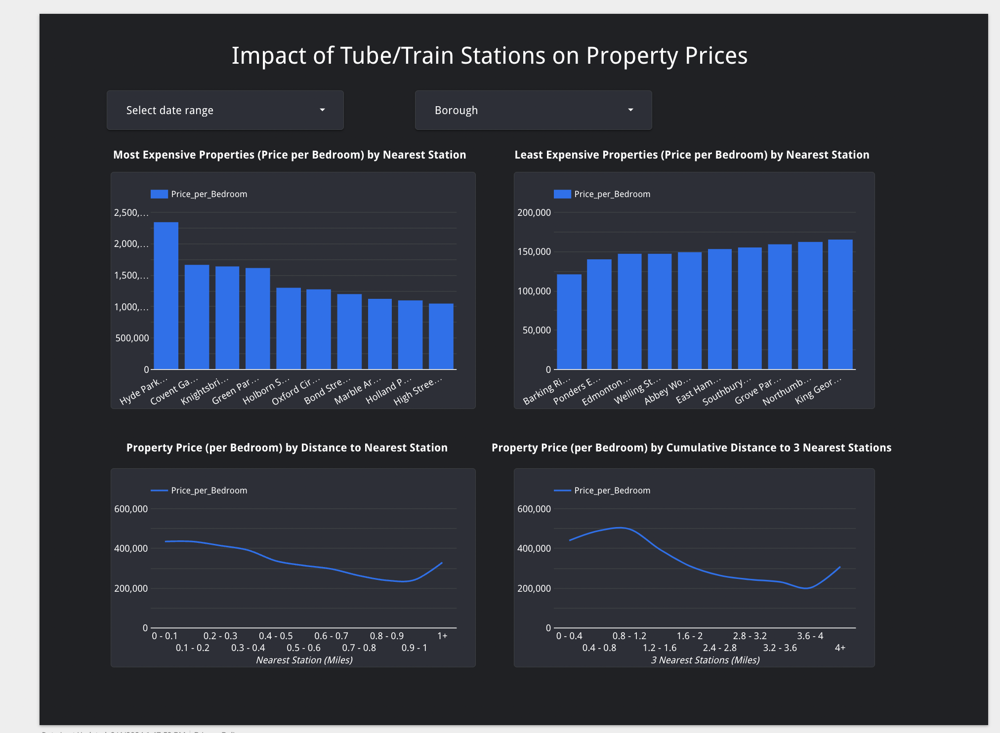

# :house_with_garden: London Properties Analysis

## Contents

- [Problem Description](#problem-description)
- [Technologies Used](#technologies-used)
- [Data Pipeline](#the-data-pipeline)
    - [The Cloud Intrastructure](#cloud-infrastructure)
    - [Data Ingestion / Orchestration](#data-ingestion--orchestration)
    - [Data Warehouse](#data-warehouse)
    - [Transformations with dbt](#transformations-with-dbt)
    - [Visualisations](#visualisations)
- [Try it Yourself](#try-it-yourself)

## Problem Description

It can be difficult to find up-to-date, detailed data on the for-sale property market. This project aims to find out how different factors (size, proximity to train/tube stations, lease length, etc.) impact property prices in London.

I've used Rightmove as the main data source for this project. As far as I'm aware, they don't provide a public API, so I built an ETL pipeline using a python script which scrapes data from the website. 


## Technologies Used

The following tools were used:

- Google Compute Engine - I used an Ubuntu (Linux distribution) Virtual Machine as the project environment
- Terraform - an Infrastructure-as-Code (IaC) tool, which were used to provision resources in my Google Cloud Platform (GCP) account
- Prefect & Github Actions - for orchestration
- Google Cloud Storage (GCS) - a GCS bucket was used for data lake storage
- Google BigQuery - a data warehouse
- DBT Cloud - data transformation  
- Looker Studio - data visualisations 

## The Data Pipeline


### Cloud Infrastructure


Terraform is used, from the Google Compute VM, to provision the Google Cloud Storage bucket (our data lake) and BigQuery datasets (our data waregouse) used in the project.

The Terraform files in this project are available in the [terraform](terraform/) folder. [main.tf](/terraform/main.tf) contains the code to provision the resources, while [variables.tf](terraform/variables.tf) contains adjustable variables which are referenced in the main.tf file.


### Data Ingestion / Orchestration


Data ingestion is orchestrated via Prefect and Github Actions. 

[web_to_gcs_bq.py](flows/web_to_gcs_bq.py) consists of 6 intermediate tasks within a `main_flow()` function:

1. A rightmove search url is created by `extract_rightmove_url()`. This has adjustable parameters which define the search results. This url is fed into `get_rightmove_results()`, which scrapes the result pages and returns a list of individual property listing urls. This function has a 'test' parameter. If set to True, the function will only return urls from the first page of results.
2. This list of property listings is then fed into a `scrape_page()`, which scrapes relevant information from each property listing and returns a list of dictionaries. Each dictionary represents an information set for one property listing. 
3. This list of dictionaries is then sent to `clean()`, which creates a pandas DataFrame and applies a schema specified in [dtypes.yaml](dtypes.yaml).
4. The dataframe is then sent to `save_to_gcp()`, where it is saved as a parquet file before being uploaded to a GCS bucket, using credentials stored in a GCP Credentials block and a GCS Bucket block created in a Prefect Cloud account
5. The london_postcodes.csv lookup file is uploaded to the GCS bucket using the `lookup_to_bucket()` function. This matches all London postcodes to their respective Boroughs and Zones.
6. Finally, `create_external_table()`, again using the GCP Credentials block, creates - if they don't already exist - two external tables in a specified BigQuery dataset. One holds the raw rightmove data - this points to the GCS bucket location which is storing the parquet files. The other holds the postcode lookup data. 

Github Actions is then used to schedule this Prefect flow. The [.github/workflows](.github/workflows/) folder contains [scheduled.yaml](.github/workflows/scheduled_run.yaml), which is set to run daily (using cron scheduling). 
- This script, when triggered, creates an ubuntu VM runner and installs python 3.11 and the dependencies specified in [requirements.txt](requirements.txt) onto the newly-created VM. It then logs into a specified Prefect Cloud account from a terminal session and runs the Prefect flow. The script is currently configured to not run as a test (the test parameter is set to False). This can be changed by editing the yaml file.
- The [.github/workflows](.github/workflows/) folder also contains two further yaml scripts, which do the same as the above, but with different triggers. One - [push_to_main_run.yaml](.github/workflows/push_to_main_run.yaml) - is triggered when changes are pushed to the main branch of the github repo. I've disabled this github action. The other - [manual_run.yaml](.github/workflows/manual_run.yaml) - can be triggered manually from the Actions tab within your github repo, and requires that the user specify whether it is a test run or not. 


The [web_to_gcs_bq.py](flows/web_to_gcs_bq.py) is rate-limited, and so a full run (with test set to False) can take ~30 minutes to complete. This has been done to ensure that the sript doesn't make too many requests within a given period of time, something which could see your IP address blocked. For every 6 pages that the script scrapes, there is a randomised wait of between 2 and 5 seconds before moving to the next page. There is then a randomised wait between 10 and 25 seconds every 50 pages that the script scrapes added to this.


### Data Warehouse

All data is warehoused in BigQuery.
- The output of the ingestion script containing scraped Rightmove data is stored as an external table within BigQuery
- A postcode lookup table is also held in BigQuery (this has also been produced by the ingestion script) - this contains a list of London postcodes and their Boroughs. Lookup tables would typically be held as seeds from within a dbt project, but this lookup table was too large for that to be appropriate.
- This data is then transformed in DBT and materialised into tables
    - The data is partitioned using the Date_Listed field - as most filtering is likely to occur on the date column.
    - The data isn't clustered, as we are only handling a small quantity of data and so it isn't at this point efficient to cluster.


The following jinja code is used in dbt to materialise the tables:
- the tables are materialised by Date_Listed on a "day" level of granularity
- the tables are materialised incrementally. This means that the first time a model is run, the table is created by transforming all rows of source data. On subsequent runs, dbt transforms only the rows in your source data that you tell dbt to filter for. This limits the amount of data that needs to be transformed, reducing the runtime of transformations.


```sql
{{ config(
    materialized='incremental',
    partition_by={
      "field": "Date_Listed",
      "data_type": "DATE",
      "granularity": "day"
    }
)}}

-- the below is added after the sql query to specify which rows we want to materialise in BigQuery


-- {{This}} refers to target table in BigQuery
-- So, we're adding any rows where rows with the same id and Date_listed aren't already in the BigQuery table
where concat(id, ' ', Date_Listed) NOT IN (SELECT concat(id, ' ', Date_Listed) FROM {{this}})


```


### Transformations with dbt

dbt defines and orchestrates the data transformations for this project - see the DAG below. This is also scheduled to run on a daily cadence, an hour and a half after the daily rightmove data has been ingested.


- Data is read from the `london_postcode_lookup` external table in BigQuery, is cleaned, and is materialised as the `stg_postcode_lookup` view. 
- Data is read from the `raw_london_properties` external table in BigQuery, which references the parquet files produced by the ingestion script, and is cleaned and joined with the postcode lookup view to include a new 'Borough' column. This is materialised as a view called `stg_cleaned_london_properties`.
- This view is then used to create two new models, which both materialise tables in BigQuery:
    - `price_to_features` - this table consists of property price (and price per bedroom) alongside several features which might influence property price. Lease length, size (sqm) and service charge are grouped into bands to allow for easier visualisation in Looker.
    - `price_to_stations` - this table consists of property price (and price per bedroom) alongside columns relating to nearest stations and distance from nearest stations. 
        - Here, I wanted unique property ids (some properties are listed multiple times - when added, and when the price is reduced). To do this, I used a window function within a Common Table Expression to ensure only the most recent listing was included. ***See first sql code block below***.
        - I also wanted to ensure that only stations that appeared 5 or more times in the raw dataset were included in the model, to avoid sampling errors. To do this, I used a second CTE, which produces a list of unique stations that appear more than 5 times. This can then be inner joined to the final query, ensuring that only rows where the nearest station is in the output of the CTE (i.e. appear 5 of more times) are materialised. **See second sql code block below***.

```sql
With list_date_rank as (
    SELECT id,
        Date_Listed,
        ...
        ROW_NUMBER() OVER (PARTITION BY id ORDER BY Date_Listed DESC) AS rnk
    FROM {{ ref('stg_cleaned_london_properties') }}
)

SELECT ...
FROM list_date_rank
WHERE rnk = 1
```


```sql
stations_five_or_more AS (
    SELECT Nearest_Station as N_S,
        COUNT(*) as Cnt
    FROM list_date_rank
    WHERE rnk = 1
    GROUP BY Nearest_Station
    HAVING Cnt >= 5
)

SELECT ...
FROM list_date_rank as p
INNER JOIN stations_five_or_more
ON stations_five_or_more.N_S = p.Nearest_station
```


### Visualisations

The interactive dashboard was set up using Looker Studio and can be found [here](https://lookerstudio.google.com/reporting/dce54e76-c815-447a-9089-3622deeeffa9/page/p_zc6mkshred).

All 3 pages can be filtered further by date (which refers to the listing date) and Borough.





## Try it yourself

If you want to reproduce this pipeline and play around with the data, see detailed instructions [here](reproduce.md).


