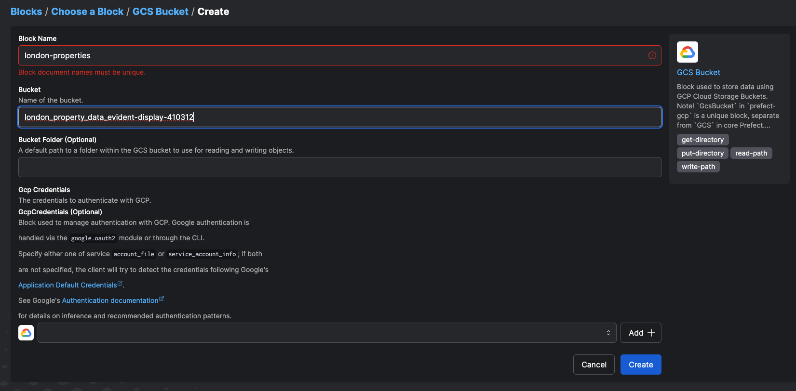
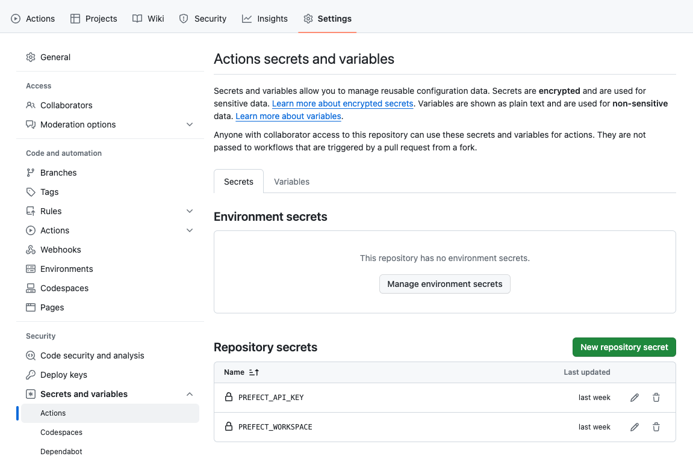
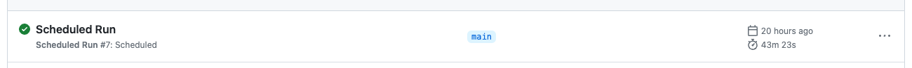
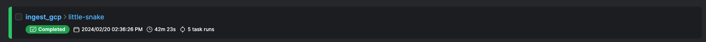
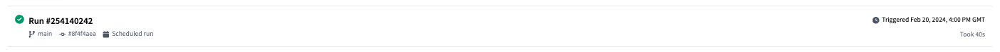

# Reproduce the Pipeline


## Contents


## Prerequisites

The project was developed using an Ubuntu VM instance created within my GCP account. This isn't required, and a different environment can be used, but these instructions assume that your local environment is Ubuntu. I used the VM to provision cloud resources with Terraform, and to develop and test the prefect ingestion script.

You need the following accounts (all are either free indefinitely or available on a free trial):

- Google Cloud Platform - 90 day free trial offered, with $300 in free credits
- Prefect Cloud - free tier available indefinitely
- DBT Cloud - free tier available indefinitely
4- Github - free trier available indefinitely

## Setup GCP Project

Create a new project in the [Google Cloud Console](https://console.cloud.google.com/), and switch to that newly created project

## Create a Service Account and Generate a JSON Key

Vavigate to IAM & ADMIN &rarr; Service Accounts on the Google Cloud Console and create a new service account 

This service account will be used by Prefect and DBT, and needs to be granted the following roles:
- Viewer
- Storage Admin
- Storage Object Admin
- BigQuery Admin

Now click continue and navigate to the ... on the right hand side &rarr; select manage keys

Select Add Key &rarr; Create New Key &rarr; JSON Key &rarr; Create

The key will be downloaded to your local computer - this key will be used later on in the setup process. 


## Create VM instance

- From the GCP Navigation Menu: Compute > Compute Engine > VM Instances > select "create instance"
- Select a name, region and zone that is nearest to you. Make a note of the region - as we'll deploy all resources to that region
- Choose a machine type that works for you. For this project, e2-medium was used.
- Choose a Boot disk: this project used Ubuntu 20.04 LTS, with a size of 30 GB
- Select "create"

You might need to enable to compute engine API if you haven't created a VM on your GCP account before

## Setup SSH to VM


git bash already has an ssh client - this is the client we'll use to connect to the VM instance

[This link](https://cloud.google.com/compute/docs/connect/create-ssh-keys) explains how to create an SSH key pair on Linux/macOS/Windows, which you can use to connect to your VM


```sh
ssh-keygen -t rsa -f ~/.ssh/<KEY_FILENAME> -C <USERNAME> -b 2048
```
- run `mkdir .ssh` first if the folder doesn't already exist
- Replace <KEY_FILENAME> with the name for your SSH key file e.g. gcp
- Replace <USERNAME> with the username you want on your VM
- ssh-keygen saves your private key file to ~/.ssh/<KEY_FILENAME> and your public key file to ~/.ssh/<KEY_FILENAME>.pub
- You can provide a passphrase if you'd like, but this is optional. If you do enter a passphrase, you will need to use it every time you log into the VM

You can display the public key using the following command:

```sh
cat .ssh/<KEY_FILENAME>.pub 
```

Copy the output, and within Google Cloud's Navigation Menu navigate to Compute > Compute Engine > Srttings > Metadata. Here, navigate to the "SSH KEYS" tab, select "Edit" at the top and click "ADD ITEM" and paste the public key into the text box.

Create a `config` file under your .ssh directory with the following:

```
Host <host_name_to_use_when_connecting>
    HostName <VM external IP>
    User <username>
    IdentityFile <private ssh key location> e.g. ~/.ssh/privatekey
```

Go to your terminal and run the following command to connect to your VM instance:

```sh
ssh <host_name_to_use_when_connecting>
```

The VM external IP address is by default ephemeral - it will change when you stop and start the VM - and so you'll need to update this config file to continue to be able to login using the above command. Alternatively, you can [reserve a static external IP address](https://cloud.google.com/compute/docs/ip-addresses/reserve-static-external-ip-address) and attach it to your VM instance.

## Connect VSCode to VM


If you're using VSCode as your code editor, you can do the following to connect to your VM instance:

- search Extensions for SSH and install Remote-SSH
- Install Python extension if you need to
- In the lower left hand corner of your VSCode window, select the green icon to open a remote window
- Select "Connect to Host..." and either choose your ssh connection or type in the name you choose for 'Host in your config file

## Configure VM and Install Dependencies

**First run the following code in the terminal:**

```sh
sudo apt update && sudo apt upgrade -y; \
sudo apt install wget unzip
```

**Install [Anaconda](https://docs.anaconda.com/free/anaconda/install/linux/#installation)**

```bash
wget https://repo.anaconda.com/archive/Anaconda3-2023.09-0-Linux-x86_64.sh && \
bash Anaconda3-2023.09-Linux-x86_64.sh
```
- The python version installed here is 3.11

**Set the $GOOGLE_APPLICATIONS_CREDENTIALS env-var**
- Make a new directory to store our service account credentials: ```mkdir -p .google/credentials```
- Move the service account JSON key created earlier into this folder
- Add the following to the .bashrc file: ```export GOOGLE_APPLICATION_CREDENTIALS=~/.google/credentials/<name-of-creds-file>.json```
- Then run ```source .bashrc```
- Authenticate by running: ```gcloud auth activate-service-account --key-file $GOOGLE_APPLICATION_CREDENTIALS```


**Install [Terraform](https://developer.hashicorp.com/terraform/tutorials/aws-get-started/install-cli#install-terraform)**
- Create a /bin folder and edit the .bashrc file to add /bin to the PATH variable - which enables the system to locate programs within that folder without needing the full path for execution

```sh
mkdir ~/bin
cd .bin
nano .bashrc # this opens an editor and you can then amend the PATH variable 
```
- In the .bashrc file, do the following:

```
export PATH="${HOME}/bin:${PATH}"
```

- Run the following to apply changes:

```sh
source .bashrc
```

- Navigate to the /bin directory and run the following commands:

```sh
wget https://releases.hashicorp.com/terraform/1.6.6/terraform_1.6.6_linux_amd64.zip
unzip terraform_1.6.6_linux_arm.zip # this gives us an executable terraofrm file
```

- As the bin directory is in our PATH variable, terraform should be discoverable in the terminal using the 'terraform' command. Run the following to verify:

```sh
terraform --version
```


**Clone the github repository:**

Fork my github repository and then clone the forked repository to your local machine

```sh
git clone <forked_repo_https_url>
```

- Once you've navigated the repo directory, run the following to install requirements:

```sh
pip install -r requirements.txt
```


## Provision Cloud Resources with Terraform

`cd` to the terraform directory within your VM and edit the [variables.tf](terraform/variables.tf) file with the relevant information from your setup. I'd recommend leaving the name of the bucket and dataset as they are; otherwise you'll need to amend the prefect flow and dbt models too:

```tf
variable "project" {
  description = "Project"
  default     = "evident-display-410312"
}

variable "region" {
  description = "Region for GCP resources"
  #Update the below to your desired region
  default = "europe-west2"
}

variable "location" {
  description = "Project Location"
  #Update the below to your desired location
  default = "EU"
}
```

There is no need to specify a credentials variable if you have already set the $GOOGLE_APPLICATIONS_CREDENTIALS variable

To run:
- `terraform init`
- `terraform validate` - this is optional
- `terraform apply` - this is optional
- `terraform apply`

Check that the bucket and dataset have been created by navigating through the GCP Console.


## Prefect and Github Actions Setup

go to Prefect Cloud to create a free account. Once logged in, create a [workspace](https://app.prefect.cloud/workspaces/create) and an [API key](https://app.prefect.cloud/my/api-keys)

In the Prefect Cloud UI, create 2 blocks:
- Navigate to Blocks, and search for 'GCS Bucket'
  - name the block 'london-properties' so that you don't have to change the prefect flow. Fill in the bucket name with the name of the bucket you provisioned using Terraform
  - Add the bottom of the page, you'll be prompted to add GCP credentials
  - Select "Add +" and copy and paste the contents of your service account JSON key into the text box. Name the GCP credentials block 'london-properties-analysis' so that you don't have to amend the prefect flow.





Add the API key you've just created and the name of your workspace as repository secrets in your forked remote github repo:
- Navigate to Settings > Security > Actions > New Repository Secret
- PREFECT_API_KEY (should start with pnu_)
- PREFECT_WORKSPACE is a combination of your account/workspace. For me, it was "phil_grim/default"



These two secrets are referenced by the github action yaml scripts, and so the `web_to_gcs_bq.py` script should now be able to run with github actions.
- Navigate to the Actions tab in your remote github repo. Check that Run on Push and Scheduled Run are disabled. 
- When enabled, Scheduled Run should run at 14:30 UTC every day. Run on Push will run when changes are pushed to main branch.
- You can trigger the Manual Run by selecting 'Run workflow'. For the 'Run a test flow' input, select True if you want the flow to only scrape the first page of Rightmove property results, and False if you want the script to scrape all pages. 

>N.b The full run can take over 30 minutes, so it's best to use Manual Run at first and set 'Run a test flow' to True. Once you're confident that everything works, you can set 'Run a test flow' to false, or enable Scheduled Run and have the full flow run on a schedule.


## DBT Setup

Ensure that [schema.yml](dbt/models/staging/schema.yml) includes the correct BigQuery credentials:

```yml
sources:
    - name: staging
      database: {your-database-name} # this should be your GCP project id
      schema: properties_dataset # assuming you kept the same bq_dataset_name in your terraform variabes.tf script
```

Create a [dbt cloud account](https://www.getdbt.com/signup). Once you've logged in, you'll be prompted to create a new project.

You will need:
- access to your BigQuery Data Warehouse - using the JSON key you generated from your GCP service account earlier
- admin access to your github repository, which is where the dbt project is stored.

1. Name your project
2. Choose BigQuery as your data warehouse
3. Upload the JSON key on the "create from file" option. This will fill out most fields related to production credentials
4. Scroll to the bottom and setup your development credentials. The dataset name refers to the BigQuery dataset where any models you create while developing in dbt will be created. Make sure this dataset exists in your BigQuery warehouse. For this project, the development dataset was called 'properties_development'
5. Click test and then continue with setup

Adding Githup Repo to your project:

1. From your github fork, copy the ssh link
2. In the dbt set up, select "git clone" from "Add repository from:", paste the ssh link and select import
3. This will generate a deploy key. Copy this, and head back to yuor github repo > Settings > Security > Deploy keys > Add deploy key
4. Paste the deploy key and name it something like "dbt". Remember to select "Allow write access" before adding the key
5. In dbt Cloud, go to Account Settings > Projects > Select your project to get to "Project Details", and change the Project subdirectory to "dbt"


### Deploy dbt 

Go to environments in dbt and create an environment - you can name this "production"
- The Environment Type should be "deployment"

Choose a BigQuery dataset - this is where the models will be created. My project used a dataset called "properties_production". Make sure this dataset exists in BigQuery - create it if it doesn't.

Go to jobs in dbt cloud and create a new job with the following parameters:
1. Job Name - "dbt build" (you can call this what you'd like)
2. Environment - "production" (add the name for the deployment environment you created earlier)
3. Select "Generate docs on run"
4. Commands: add "dbt build"
5. Run on a trigger - with a "Custom Cron Schedule" of `0 16 * * *`. This will run the job every day at 4pm, giving enough time for the prefect flow (scheduled for 2:30pm every day) to have finished running.


## Looker Studio Visualisation

1. In your browser, navigate to [Looker Studio](https://lookerstudio.google.com/) and click the "Create" button to add a data source
2. Under Google Connectors, select "BigQuery", and authorize your account
3. Navigate to the relevant dataset and select a table to build a report with.


## Flows

Assuming everything is working correctly:

### Github Actions:



### Prefect Cloud:



### DBT Cloud:


